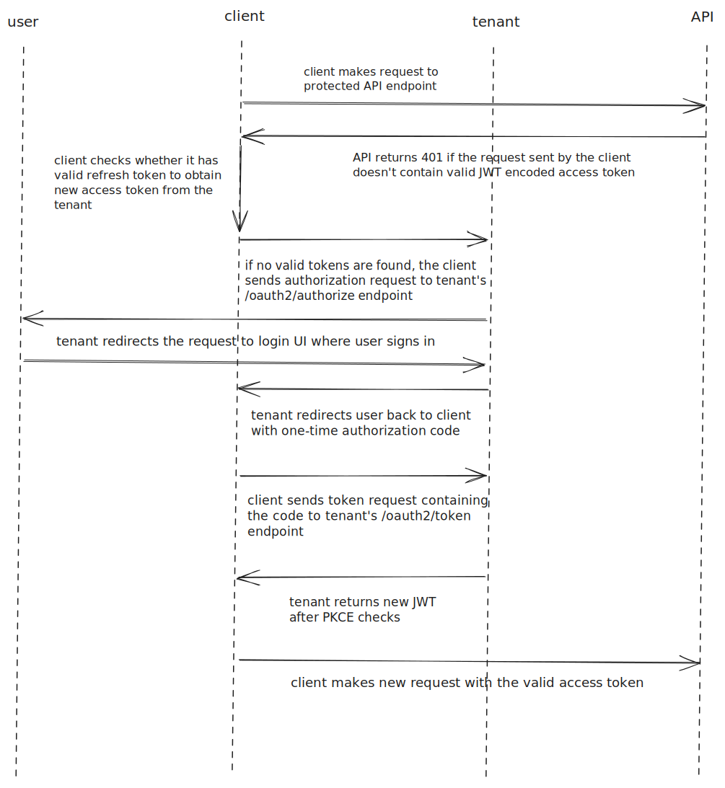

# RESTful API utilizing PKCE-enhanced OAuth2 via AWS Cognito

<p align="left">
<a href="https://github.com/17ms/zeronote/actions/workflows/ci.yml"></a>
<a href="https://github.com/17ms/zeronote/tags"></a>
<a href="https://opensource.org/licenses/MIT"></a>
</p>

## Authentication & authorization flow



## Setup

The repository contains a shellscript `setup_dev.sh` that can be used to create a self-signed certificate and possibly setup port forwarding with `iptables`:

```shell
chmod +x setup_dev.sh
./setup_dev.sh -c # create cert
./setup_dev.sh -r # forward :3000 -> :443
```

After creating `cert.pem` and `key.pem`:

```shell
cargo build --release
./target/release/zeronote
```

The API will be listening to `https://localhost` by default. A separate Dockerfile will be added in the future.
