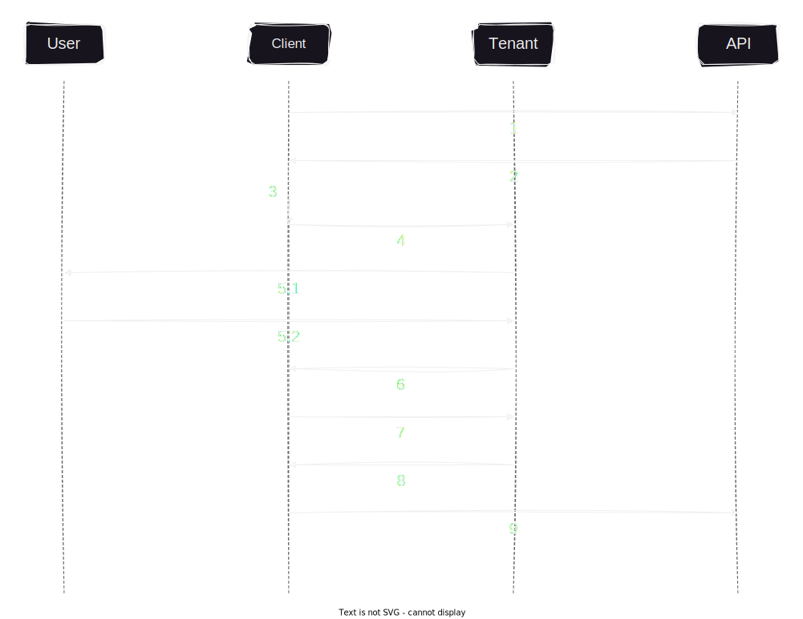

# RESTful API utilizing PKCE-enhanced OAuth2 via AWS Cognito

<p align="left">
<a href="https://github.com/17ms/zeronote/actions/workflows/ci.yml"></a>
<a href="https://github.com/17ms/zeronote/tags"></a>
<a href="https://opensource.org/licenses/MIT"></a>
</p>

## Authentication & authorization flow



1. Client makes a request to a protected API endpoint.
2. API returns a 401 response if the request sent by the client doesn't contain a valid JWT encoded access token.
3. Client checks whether it has a valid refresh token to obtain a new access token from the tenant.
4. If no valid refresh or access tokens are found, the client sends authorization request to tenant's `/oauth2/authorize` endpoint.
5. Tenant redirects the request to a login UI where the user logs in or signs up.
6. Tenant redirects user back to the client with a one-time authorization `code`.
7. Client sends a token request containing the `code` to tenant's `/oauth2/token` endpoint.
8. After doing the PKCE checks the tenant returns a new JWT.
9. Client makes a new request with the valid access token to the protected API endpoint.

## Setup

The repository contains a shellscript `setup_dev.sh` that can be used to create a self-signed certificate and possibly setup port forwarding with `iptables`:

```shell
chmod +x setup_dev.sh
./setup_dev.sh -c # create cert
./setup_dev.sh -r # forward :3000 -> :443
```

After creating `cert.pem` and `key.pem`:

```shell
cargo build --release
./target/release/zeronote
```

The API will be listening to `https://localhost` by default. A separate Dockerfile will be added in the future.
